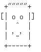

# 作业


##  编写一个Java程序，用户输入什么字符就提示什么字符，比如输入a，给出提示您输入的字符是"a".

​	(范围在0-9以及小写字母a-z以及，大写字母A-Z)
	

## 写一个程序，根据用户的答案给出正确的解释

```
eg:

a. int 1x=10;

b. int x=10;

c. float x=10.0f;

d. string x="10";

 当输入C， 恭喜你，答对了。

```


##  根据用户输入1-12，打印对应的月份的英文名称。

## 编写一个Java程序来打印一张脸




## 接受用户输入三个数，如果它能成为三角形，输出，“你好三角”，继续判断它是什么三角形，锐角？直角？钝角？

   如果不能，提示，“三人行，一个师傅都冒得”。


