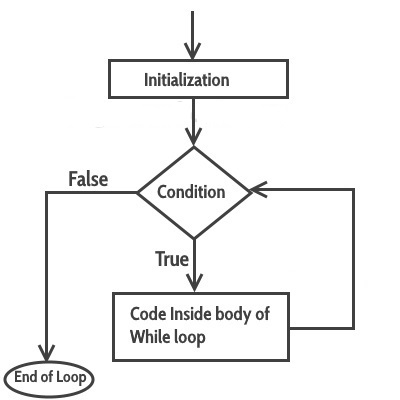
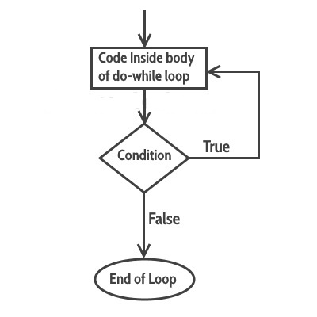

# 复杂循环


**复习预习检查**

- swtich语法结构
- switch执行流程
- 什么是循环


**学习目标**

- 理解什么是循环
- 掌握while循环的语法
- 掌握do while循环用法
- for循环


## 问题:1+2 + 3... + 100

请问你会怎么办?

## 什么是循环

## while

### 语法:

```java
while （condition ）{ 
   statement （s ）; }
```

### 执行流程




### break


### continue


## do while

### 语法


```java
do
{
   statement(s);
} while(condition);
```

### 执行流程




## while VS do while

## for


### 语法


```java
for(initialization; condition ; increment/decrement)
{
   statement(s);
}
```

## 我是特种兵之代码训练

### 问题1

循环询问是否继续打豆豆,当回答n(不区分大小写)则推出,否则一直打豆豆.


### 问题2

编写Java程序来打印等价于从1到122的Ascii代码的字符表。


### 问题3

一球从100米高度自由落下，每次落地后反跳回原高度的一半；再落下，求它在 第10次落地时，共经过多少米？第10次反弹多高？ 


###  问题4

求1+2!+3!+...+10!的和


