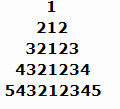

# 1. 作业

## 1. 写一个for循环，从1000计数到0，步进值为-2 

## 2. 10.ASCII码中的小写字母与大写字母相差32。于是，如果要将小写字母转换为大写字母，需要减去32。利用这点写一个程序，它从键盘中读入字符，将输入的小写字母都转化为大写字母，大写字母都转化为小写字母，并显示结果。对于其他字符，不要做任何改变。当用户输入英文句号时程序结束。在程序末尾，输出改变了大小写的字符的个数。

## 3. 循环图 

## 4. 输出99乘法口诀 

## 5. 有30人，可能包括男人、女人、小孩，他们在一饭店共消费50先令，其中每个男人花3先令，每个女人花2先令， 	每个小孩花1先令，求男人、女人、小孩各多少人？ 

## 6. 输入一个正整数判断它是否是回文数

比如12321就是的，一个对称的数。

