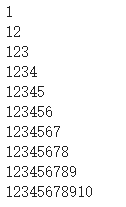
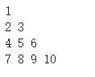
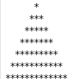
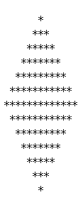
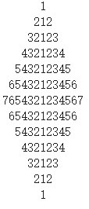

# 复杂循环

**复习预习检查**

- while循环特点
- do while循环特点
- 什么是循环

**学习目标**

- 二重以及多重循环的理解与运用

## 我的特种兵之代码训练

### 问题1

用Java编写一个程序，用直角三角形显示一个数字 如下图:

### 问题2

编写一个程序如下图:

### 问题3

编写程序如下:

### 问题4

编写程序如下:

### 问题5

编写程序如下:

